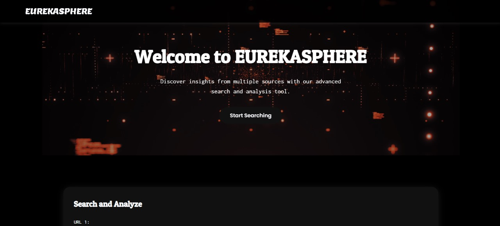
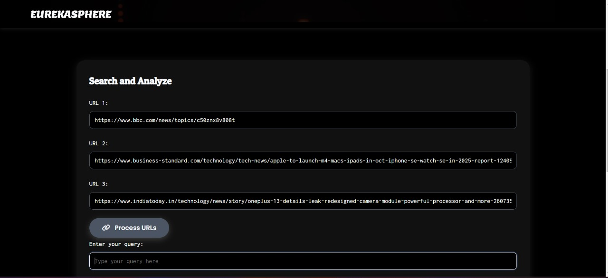
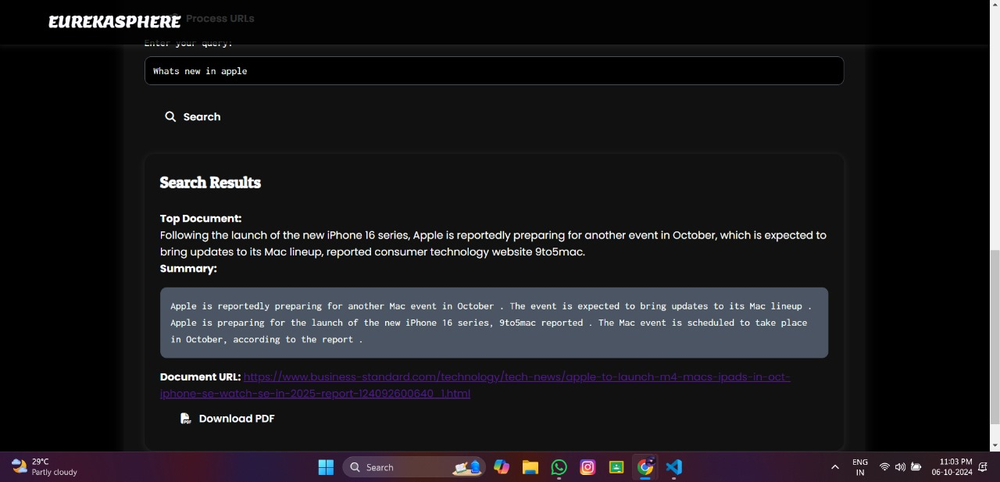
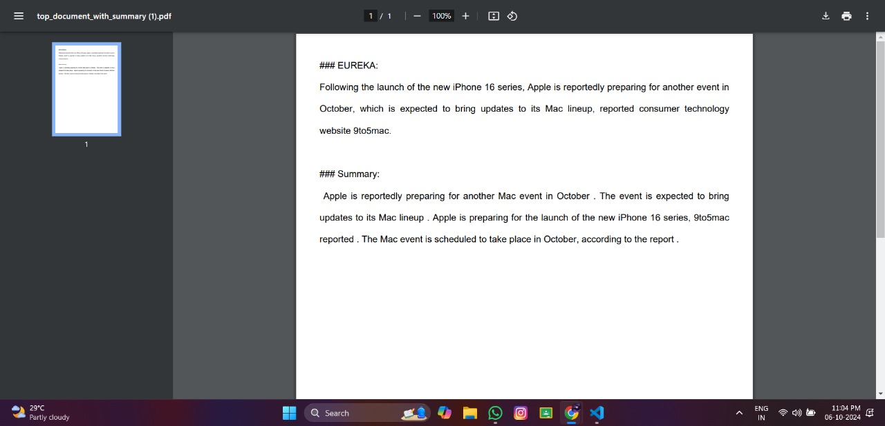

# Eureka: Exploratory Understanding and Research Knowledge Assistant

Eureka is an AI-powered solution designed to automate content retrieval, summarization, and document similarity search, helping users efficiently explore diverse information sources. Integrated into a user-friendly Streamlit app, Eureka accepts a wide range of URLs for research and analysis.

## Problem Statement

Researchers face several challenges in gathering and processing knowledge:

- **Information Overload**: Vast amounts of information make it difficult to identify relevant and reliable sources.
- **Time-Consuming Processes**: Manual research, reading, and extracting information can consume significant time and effort.
- **Lack of Context**: Identifying connections across different sources requires manual analysis, leading to potential biases and missed insights.

## Solution

Eureka provides an automated, efficient way to perform exploratory research. By using advanced NLP techniques, it performs the following tasks:

1. **Web Scraping**: Automatically extracts content from online sources such as research articles and news websites.
2. **Document Embedding**: Converts the scraped content into numerical vectors for semantic representation.
3. **Dynamic Summarization**: Generates concise summaries of retrieved documents based on user queries.
4. **Similarity Search**: Uses FAISS to search for and retrieve documents based on similarity to user inputs.
5. **PDF Generation**: Compiles insights into easily shareable PDF reports.

## Why Eureka?

Eureka offers several advantages over traditional systems and AI chatbots like ChatGPT:

- **No Word Limit**: Unlike ChatGPT, Eureka imposes no word limit, making it ideal for handling large documents.
- **Lightweight and Efficient**: Eureka is designed to be lightweight, processing and analyzing content faster.
- **Chunked Content Processing**: It breaks content into manageable chunks for efficient analysis, ensuring no information is missed.
- **Automated Content Retrieval**: Automatically scrapes content from multiple sources, eliminating manual searches.
- **Summarization and Similarity Search**: Provides dynamic document summarization and FAISS-powered similarity search for research purposes.
- **Wide URL Acceptance**: Eureka accepts diverse URLs from various domains, making it suitable for exploratory understanding across different fields.


## Key Features

- **Dynamic Summarization**: Get concise summaries from large documents using the Hugging Face `distilbart-cnn-12-6` model.
- **Similarity Search**: FAISS-powered search allows for efficient retrieval of documents similar to the ones provided by the user.
- **PDF Generation**: Automatically compiles extracted insights into PDF format for easy reference.
- **Scalable and Efficient**: Eureka handles large datasets and complex queries, making it scalable for research projects of any size.

## System Architecture

1. **Web Scraping**: Retrieves relevant content from online sources.
2. **Document Embedding**: Transforms content into numerical representations.
3. **Summarization Module**: Summarizes content dynamically based on queries.
4. **Similarity Search**: Retrieves documents using FAISS.
5. **PDF Generation**: Outputs analysis results in shareable PDF format.

## Getting Started

## Prerequisites

- Python 3.8+
- Flask
- Hugging Face Transformers
- FAISS
- BeautifulSoup (for web scraping)
- HTML, CSS, and JavaScript (for frontend)


### Installation

Clone the repository:

```bash
git clone https://github.com/yourusername/eureka.git
cd eureka
```
Install the necessary packages:
```bash
pip install -r requirements.txt
```
Run the app:
```bash
python equityresearchanalysismain.py
```


## Usage

- **Input URLs**: Provide a list of URLs for Eureka to scrape and analyze.
- **Query for Summarization**: Enter queries to generate dynamic summaries based on the extracted content.
- **Similarity Search**: Use input text to find and retrieve similar documents.
- **PDF Generation**: Save results as a PDF for easy sharing and reference.

# 1. Start Page


# 2. Search and Analysis Bars


# 3. FAISS Vector Storing and Saved Alert


# 4. Results


# 5. PDF After Generation



## License

This project is licensed under the [MIT License](https://github.com/Abishekmrgstar/Eureka?tab=MIT-1-ov-file).


